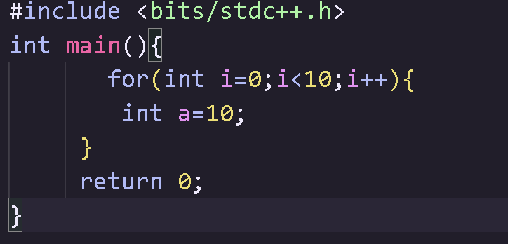
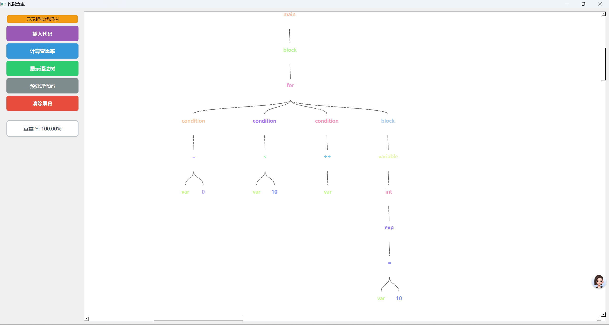
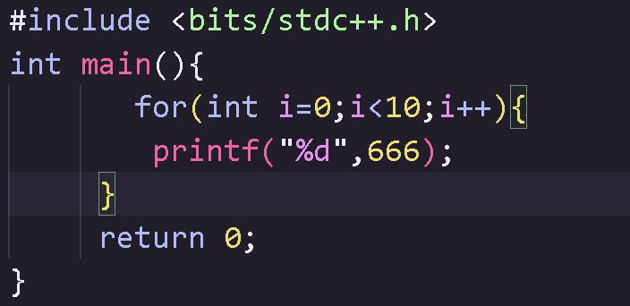
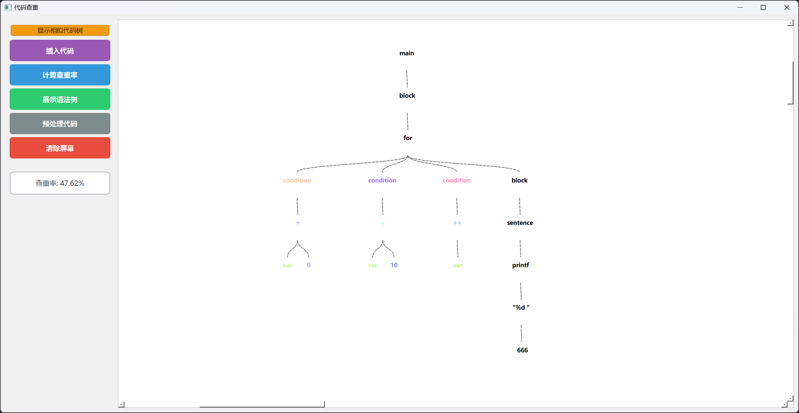
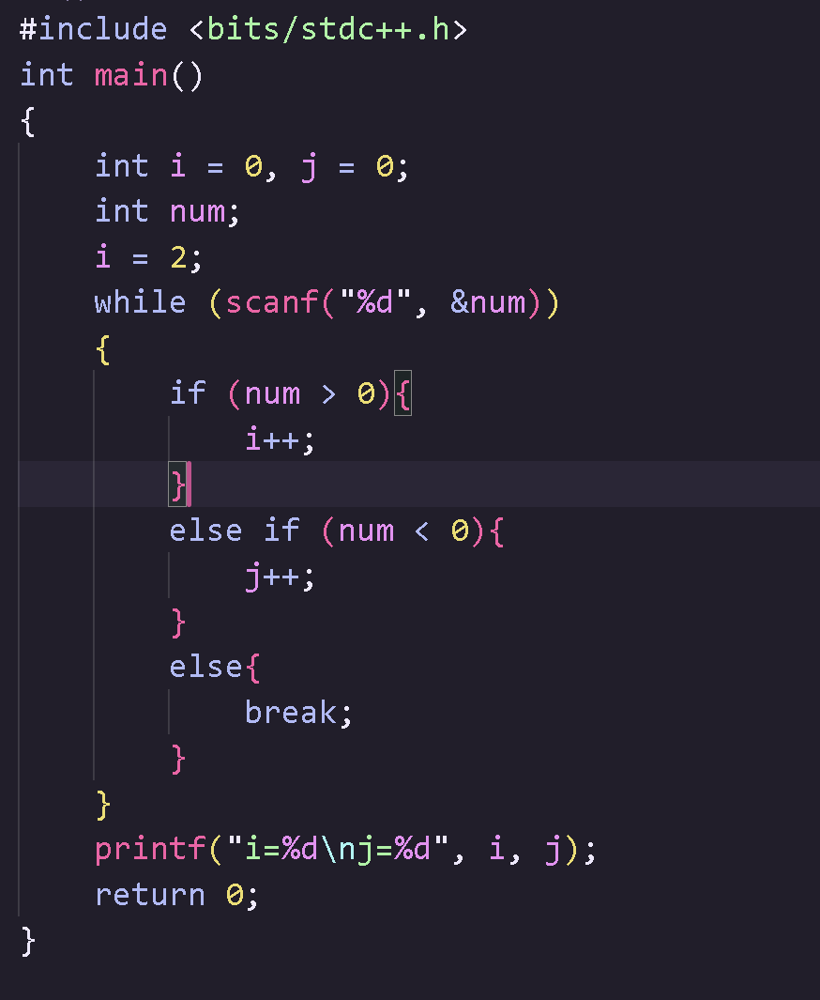
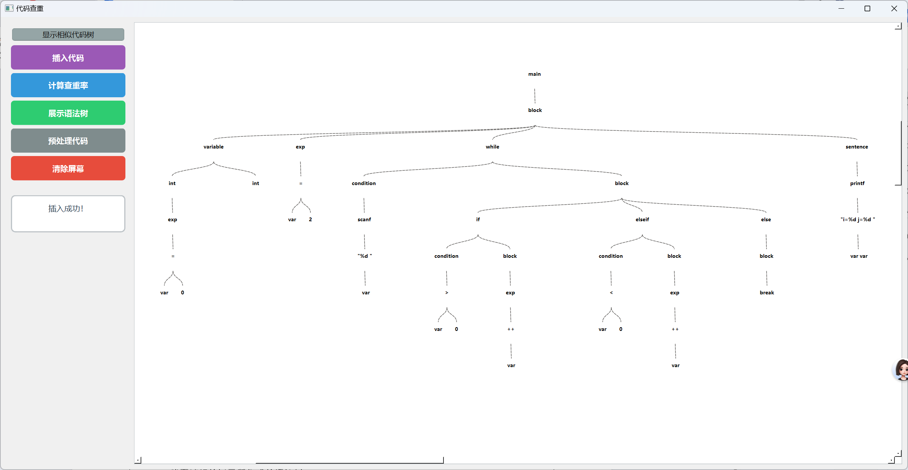

# 代码查重系统 (Code Duplication Detection System)

一个基于抽象语法树(AST)的智能代码查重工具，使用Qt开发，提供直观的可视化界面和代码相似度分析。

项目运行效果:
输入代码：

输入代码：

输入代码：

## 🚀 项目特性

### 核心功能
- **智能代码解析**：基于AST的代码结构分析，避免简单的文本匹配
- **可视化语法树**：直观展示代码的语法结构，支持缩放和拖拽
- **相似度计算**：精确计算代码重复率
- **可随时插入或者修改代码**：方便展示自己想要的代码结构
- **高亮显示**：可标记相似的代码片段,使得变成相对应的颜色,便于快速识别
- **实时预处理**：自动处理注释、空白字符等干扰因素

### 界面特性
- **现代化UI**：基于Qt的现代化用户界面
- **交互式操作**：支持鼠标拖拽、滚轮缩放等交互操作
- **中文界面**：完整的中文用户界面，操作简单直观
- **响应式布局**：自适应窗口大小，提供良好的用户体验

### 核心模块

#### 1. AST节点系统 (ASTNode)
- 定义代码语法树的节点结构
- 支持节点哈希计算和子树比较
- 实现节点间的父子关系管理

#### 2. 代码处理器 (CodeProcessor)
- 代码预处理和标准化
- 词法分析和语法解析
- AST构建和优化

#### 3. 可视化引擎 (ASTVisualizer)
- 语法树图形化展示
- 相似节点高亮显示
- 交互式操作支持

#### 4. 主窗口界面 (MainWindow)
- 用户交互界面
- 功能按钮和操作面板
- 结果显示和状态管理

## 📦 安装与编译

### 环境要求
- **操作系统**：Windows 10/11
- **编译器**：Visual Studio 2022 (MSVC v143)
- **Qt版本**：Qt 6.9.0 MSVC2022 64-bit
- **C++标准**：C++17或更高

**使用Visual Studio编译**
   vs2022下载qt插件 并且配置好
   打开 `代码查重.sln`
   然后编译运行

### 基本操作

1. **启动程序**
   - 运行编译后的可执行文件
   - 程序会自动加载演示代码

2. **主要功能按钮**
   - **显示相似代码树**：高亮显示相似的代码片段
   - **插入代码**：导入自定义代码进行分析
   - **展示语法树**：可视化显示代码的AST结构
   - **计算查重率**：计算两段代码的相似度
   - **预处理代码**：对代码进行标准化处理
   - **清除屏幕**：清空当前显示内容

3. **交互操作**
   - **鼠标拖拽**：移动语法树视图
   - **滚轮缩放**：放大/缩小语法树
   - **Ctrl+滚轮**：快速缩放

### 功能演示

程序内置了两段演示代码，展示了：
- 循环结构的相似性检测
- 条件语句的匹配分析
- 变量声明的重复识别
- 函数调用的相似度计算

## 🔧 技术特点

### 算法优势
- **结构化分析**：基于AST而非文本，避免格式差异影响
- **智能匹配**：考虑代码逻辑结构，提高准确性
- **高效计算**：优化的哈希算法，快速处理大量代码

### 可视化特性
- **层次化展示**：清晰显示代码的层次结构
- **颜色编码**：使用不同颜色标识相似节点
- **交互式操作**：支持缩放、平移等操作

### 扩展性设计
- **模块化架构**：各功能模块独立，便于扩展
- **接口标准化**：统一的API接口设计
- **配置灵活**：支持自定义配置和参数调整

## 🤝 贡献指南

欢迎提交Issue和Pull Request来改进这个项目！